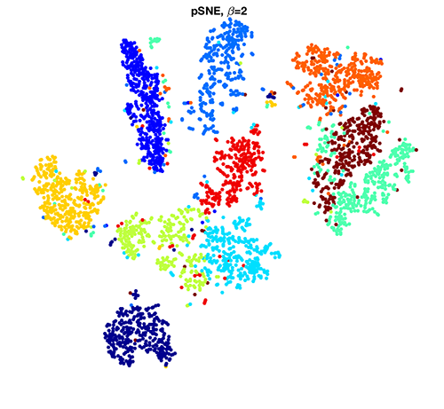
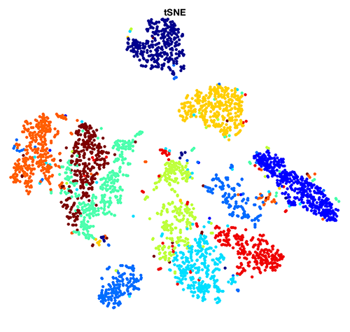
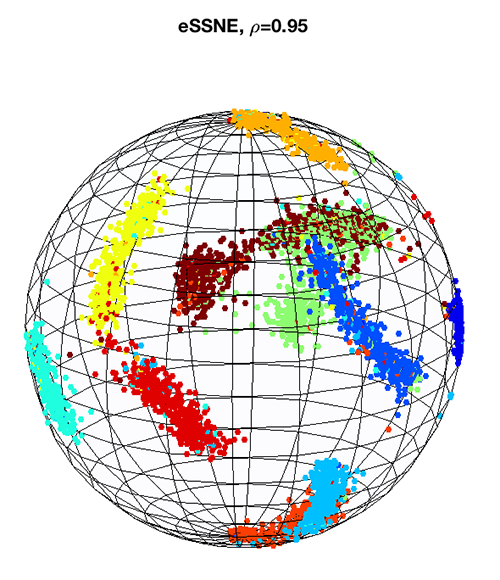

# Power-Law SNE

Perform an unsupervised dimensionality reduction of data using **power-law SNE, generalized SNE, spherical SNE, and t-SNE**, where the generalized SNE allows us to adjust the loss function from the Kullback–Leibler divergence to a general **alpha-divergence**.


## Getting Started
1. Download the repository.
2. **Add path** (both **GeneralizedSNE** & subfolder **techniques**) to the MATLAB.
2. Download 3 image [datasets](https://drive.google.com/file/d/0B5trx3WVKVERbnRRYkp6YVhEQTg/view?usp=sharing), MNIST, COIL-20, Olivetti faces, for demonstration.
3. Open main script `SNE_display.m` & **set path** for the 3 datasets in the beginning section. For example, placing folder `Dataset` inside `GeneralizedSNE`:
  ```python
     MNIST_file = './Dataset/MNIST/train-images-idx3-ubyte' ;        % MNIST images
     MNIST_label_file = './Dataset/MNIST/train-labels-idx1-ubyte' ;  % MNIST labels
     COIL20_folder = './Dataset/coil-20-proc' ;                      % COIL-20
     Olivetti_folder = './Dataset' ;                                 % Olivetti faces
  ```
4. Run several SNEs in `SNE_display.m`.






## Some Reference
* [Power-law stochastic neighbor embedding](http://ieeexplore.ieee.org/document/7952576/)
* [Visualizing Data using t-SNE](http://www.jmlr.org/papers/volume9/vandermaaten08a/vandermaaten08a.pdf)

## Note
The source code of the *pSNE* & *generalized SNE* are mostly based on that of [**Laurens van der Maaten**](https://lvdmaaten.github.io/tsne/)
